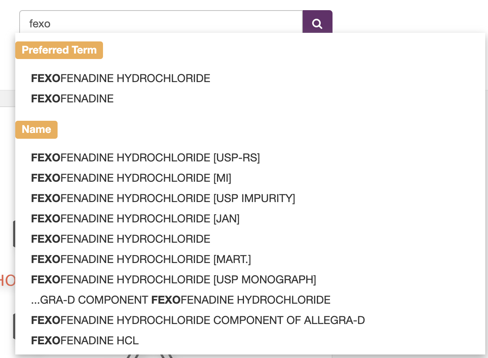

# [GSRS](https://gsrs.ncats.nih.gov/) & [Inxight Drugs](https://drugs.ncats.io/)

## Table of Contents
1. [Introduction to GSRS and Inxight Drugs](#introduction-to-both)
2. [Tools for your toolbox](#tools-for-your-toolbox)
3. [Contact Us](#contact-us)

[KNIME Workflows](https://hub.knime.com/kkelleher/spaces/Public/~MkxwIBPxYVuM-aiY/)

## Introduction to GSRS and Inxight Drugs 
[GSRS](https://gsrs.ncats.nih.gov/) is a developed and maintained in concert with the FDA, with the goal
of assisting agencies in registering and documenting information about substances found in medicines.
There is currently data for 152,696 substances, with manual review and curation of all registered data (TODO check).

[Inxight Drugs](https://drugs.ncats.io/) is based on the GSRS database, with additional data merged in from
multiple sources, covering activity data, adverse events, drug-drug interactions, toxicity, sourcing, publications,
and application instructions.

This workshop will help you explore data in the UI, download data from GSRS, and query Inxight Drugs
programmatically through the API.

## Tools for your toolbox 
### 1. Finding specific substances
* each page has a search box, use autocomplete to jump to a specific page
  * 

### 2. Reviewing primary documentation
* structural information
* target activity
* pharmacokinetics
* adverse events
* sourcing
* publications
* application
* aliases, codes, identifiers 
* related substances 

### 3. List pages
* lists substances, and facets for the list
* filterable by many facet values such as:
  * development status
  * primary target
  * highest phase
  * condition
  * treatment modality
  * substance class
  * ATC Levels

### 4. Downloading data
* GSRS download
  * https://gsrs.ncats.nih.gov/#/release
* Fast Response Database
   * https://drugs.ncats.io/downloads-public

### 5. API for Inxight Drugs
* API
  * https://drugs.ncats.io/api/v1
* Search
  * https://drugs-02.ncats.io/api/v1/substances/search?top=25&skip=0&q={{term}}
* Details
  * https://drugs.ncats.io/api/v1/substances({{UUID-or-UNII}})?view=full
* Additional Details
  * https://drugs.ncats.io/api/v1/substances({{UUID-or-UNII}})/@additional?view=full

### 6. API for GSRS
* API
  * https://gsrs.ncats.nih.gov/#/api

  
## Contact Us 

We're here to help! If you have any questions, feedback, or need assistance, please feel free to reach out to us:
* [ewy.mathe@ncats.nih.gov](mailto:ewy.mathe@ncats.nih.gov).
* [keith.kelleher@ncats.nih.gov](mailto:keith.kelleher@ncats.nih.gov).
