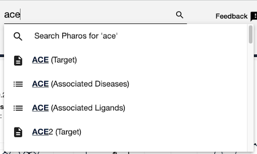
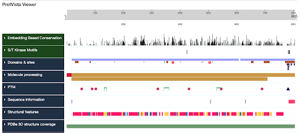
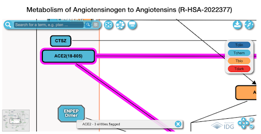
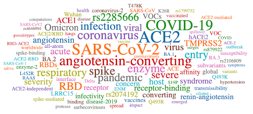
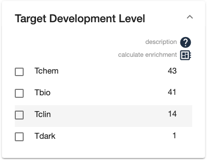
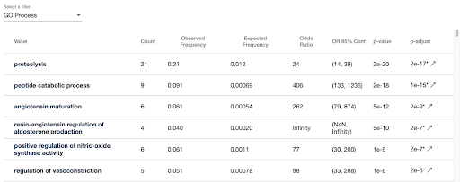
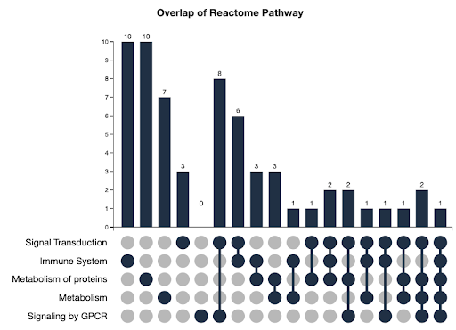

# [Pharos: Illuminating the Druggable Genome](https://pharos.nih.gov/)

[Pharos](https://pharos.nih.gov/) is the flagship web interface for the 
Illuminating Druggable Genome (IDG) Consortium, an NIH Common Fund 
project. Pharos integrates cutting-edge informatics tools and serves 
as your portal to access valuable insights and resources about 
understudied protein targets. 

This workshop will help you explore, analyze, and download data via
the web platform, as well as programmatically through the API.

## Table of Contents

1. [Introduction to Pharos](#introduction-to-pharos)
2. [Tools for your toolbox](#tools-for-your-toolbox)
3. [Scavenger Hunt](#scavenger-hunt)
4. [Contact Us](#contact-us)

## Introduction to Pharos 

Pharos is designed to streamline your research and data analysis tasks.
It offers a wide range of features to help you explore, visualize, and analyze your 
datasets efficiently.

## Tools for your toolbox 
### 1. Finding specific targets, diseases, or ligands
   * each page has a search box, use autocomplete to jump to a specific page
   * 

### 2. Reviewing primary documentation
   * The target, disease, and ligand pages have a lot of information including:
   * Sequence and structure data
     * 
   * Pathway data
     * 
   * Disease associations
   * Drug & Ligand associations
   * Publications and publication statistics
     * 
### 3. List pages
   * List pages provide capacity to filter and sort data, as well as some analysis features
   * Facets display the counts of elements in the list with particular values
     * 
   * The "computer chip" icon on the facet view allows you to calculate which values are enriched in the list, compared to the full list
     * 
   * UpSet Plots tell you about the combinations of facet values the elements in the list have
     * 
   * 
### 4. Expanding the search for data / Pivoting your search 
   * There are many options to expand your search, in the case of data sparsity
   * For Targets
     * generate a list of interacting targets
       * 
     * generate a list of targets with sequence similarity
       * 
     * generate a list of targets with the same target class
       * 
     * pivot to a list of associated diseases
       * 
     * pivot to a list of associated compounds
       * 
   * For Compounds
     * generate a list of similar compounds by structure
       * 
     * pivot to a list of associated targets
       * 
   * For Diseases
     * refine search based on MONDO disease heirarchy
       * 
     * pivot to a list of associated targets
       * 
### 5. Downloading data
   * All list pages and details pages have a download button
     * 
   * Select which fields you want to download, preview the CSV format
     * 

## Scavenger Hunt 
[answers](scavenger-hunt-answers.md)
1. Finding primary documentation
   1. What is the MONDO description for "asthma?"
   2. How many Tclin targets have associations to this disease?
   3. Which sub-class of "asthma" has the most target associations?
2. Finding ligands for a target
   1. Find the details page for target MAPK11
   2. How many active compounds are there for that target?
   3. How many have a potency above greater than or equal to 8? (i.e. 1e-8 M = 10nM)
   4. How many are selective for that target? (how many have only one documented target activity)
3. Illuminating a dark target
   1. What TDL is RAD21L1?
   2. How many direct disease associations does it have?
   2. How many interacting targets does it have?
   3. What is the most common disease associated with RAD21L1?
   4. What is the top two diseases that are enriched in the population of interacting targets?
   5. What targets have sequence similarity to Gene X? (return to target details page - find the sequence)
4. Disease Lists
   1. How many diseases are in Pharos
   2. How many are annotated to be Rare Diseases, based on GARD?
   3. Of those rare diseases, how many have an associated target that has an approved drug?
5. Investigating a new chemical compound
   1. Example smiles - CC1CC(O)(CCN1CCCC(=O)C1=CC=C(F)C=C1)C1=CC=C(Cl)C=C1
   2. How many ligands in Pharos have some structural similarity?
   3. How many ligands hav 0.8 or greater similarity
   4. What target has activity to the most ligands in that list?
6. Using UpSet Plots
   5. How many targets were on the Original IDG List?
   6. How many targets are on the current IDG List (2022 list)?
   7. How many were on the original list, but are no longer on the current IDG List?
    
## Contact Us 

We're here to help! If you have any questions, feedback, or need assistance, please feel free to reach out to our 
team at [pharos@mail.nih.gov](mailto:pharos@mail.nih.gov).
